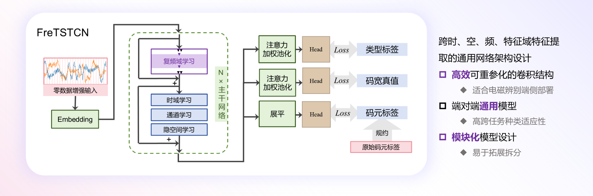
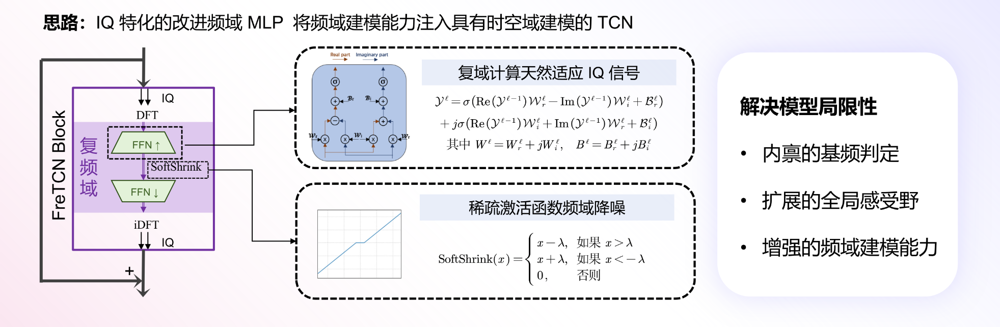

# 3rd EBDSC

*本归档为第三届“火眼金睛”电磁大数据非凡挑战赛（3rd EBDSC）铜奖（初赛第三名，决赛第四名）作品。*

> [!TIP]
> [第二届金奖（第一名）作品](https://github.com/framist/2nd-EBDSC)

## 文件结构

- 模型训练代码入口：`tcn_3rd.py`
- 在线提交测试相关代码：`model_upload/`

## 方案概述

完整演示文稿请见[此](asserts/EBDSC第三届电磁大数据非凡挑战赛决赛答辩-QiiQ-publish.pdf)

---

by Framist & KylinGR - 「QiiQ」战队 - 如有任何问题，请联系我们

QiqiiqiqiiiqiiiqQiiQiiiqQiiqQiiiQiiiQiiiQqiqiiqiqiiiqiiiqQiiQ
