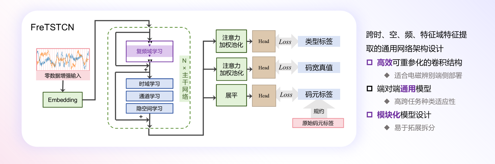
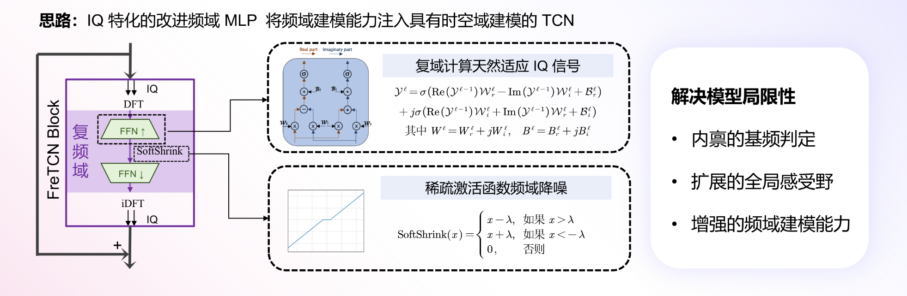

# 3rd EBDSC

*本归档为第三届“火眼金睛”电磁大数据非凡挑战赛（3rd EBDSC）铜奖（初赛第三名，决赛第四名）作品。*

> [!TIP]
> [第二届金奖（第一名）作品](https://github.com/framist/2nd-EBDSC)

## 文件结构

- 模型训练代码入口：`tcn_3rd.py`
- 在线提交测试相关代码：`model_upload/`

- **训练与推理入口**
  - `tcn_3rd.py`：离线训练与验证的主脚本，负责加载数据、构建模型、设置训练循环以及保存最优权重。
  - `model_upload/run.py`：线上推理使用的入口脚本，按照赛事官方容器要求封装模型加载与推理流程，并输出提交所需的 `csv` 文件。
- **模型结构定义**
  - `ModernTCN.py`、`ModernTCN_FTDW.py`、`ModernTCN_FreTS.py`：多种时序卷积网络（TCN）模型变体的实现，分别覆盖不同的特征提取策略。
  - `layers/`：自定义卷积、归一化及注意力等基础模块，被各模型文件复用以构建最终网络。
- **数据处理与工具**
  - `ebdsc3rd_datatools.py`：数据集读取、拆分以及在线增强逻辑的集中实现，供训练与推理脚本调用。
  - `utils/` 与 `my_tools.py`：日志记录、配置解析、指标计算等辅助函数集合。
  - `loss.py`：比赛自定义损失函数的实现，结合多任务目标在训练中联合优化。

上述脚本保持原始比赛时的结构与配置，建议在参考时结合 README 中的赛事背景说明理解其输入输出约定，并根据实际环境调整路径与依赖。

## 方案概述





完整演示文稿请见[此](asserts/EBDSC第三届电磁大数据非凡挑战赛决赛答辩-QiiQ-publish.pdf)

## 赛事信息

[赛事主页](https://challenge.datacastle.cn/v3/cmptDetail.html?id=988)

### 数据集

> 链接：https://pan.baidu.com/s/1Bndc0RbxV5gWtDRFq3MtZA?pwd=8yig 提取码：8yig
> 
> **注意：该链接仅包含训练集数据。测试集主办方未公开发布。**

1、训练集介绍：

训练集共 10 种已知调制信号序列样本（ID 映射关系具体如下：1：BPSK，2：QPSK，3:8PSK，4：MSK，5:8QAM，6:16-QAM，7:32-QAM，8:8-APSK，9:16-APSK，10:32-APSK， *11：未知*），信号产生过程涵盖了不同的信号长度、大范围脉宽、不同码元宽度，并模拟了不同信噪比 SNR 条件及多径、衰落等干扰环境，序列样本的答案为==调制类型==、==码元宽度==以及==调制码序列==。

训练数据设置信号的采样率为 20MHz，共包含 10 个文件夹，每个文件夹有 1.8W 种不同的信号长度、码元宽度、SNR 及多径的样本数据，数据格式为 csv 文件，其中

调制类型/data_i.csv
- 第一二列分别为仿真 IQ 波形，
- 第三列是仿真码序列，
- 第四列为仿真调制类型，
- 第五列为仿真码元宽度。

表 1 训练集数据样例

```csv
0.116968457,-0.116234822,1,8,0.3
0.040505204,-0.052175848,2,,
0.057982783,-0.022685991,4,,
...
-0.063333339,-0.406944517,1,,
0.310174569,-0.296002185,0,,
0.03098683,-0.021350515,,,
-0.217157376,0.133123255,,,
...
0.284242879,-0.410904562,,,
0.387534338,-0.115390908,,,
```

2、测试集介绍：

测试集数量约 2.6W 个样本，包括若干不同调制类型、不同信号长度码元宽度、SNR 及多径的样本数据，也包含未知调制类型的信号样本（未知调制类型包括但不限于 256QAM、OFDM），针对已知调制类型的信号样本要求解析出其调制类型、码元宽度以及码序列，针对未知调制类型的信号只需要给出**未知标签（这里统一为标签 11），不需要预测其码元宽度和码序列**。

测试数据设置信号的采样率为 20MHz，数据格式为 csv 文件，其中第一二列分别为仿真 IQ 波形，数据格式如表 2 所示：

表 2 测试集数据样例

### 提交

注意：数据中可能存在少量数据错误或干扰，请选手自行处理。

1、提交说明

选手提交模型，在线上进行推理，选手模型需要生成一个.csv 格式的结果文件，编码为 UTF-8，第一行为表头，如下例：

```csv
file_name,modulation_type,symbol_width,code_sequence
00001.csv,1,0.1,1 2 3
00002.csv,2,0.1,0 1 1 0 0 1 0 0 0 1 0 1 1 0
00003.csv,3,0.45,1 1 0 0 1
00004.csv,11
00005.csv,7,0.45,1 0 0 0 0 1 0 1 1 0 0 0 0 1 2 0 1 0 3 4 5
...,...,...,...
```

其中，
- file_name 为样本文件名 (str 类型），
- modulation_type 为预测的调制类型（int 类型），
- symbol_width 为预测的码元宽度（float 类型），
- code_sequence 为预测的码元序列（str 类型，序列内容为若干整数，整数之间用空格分隔）。
- 如果预测为未知类别（即类别 11），不需要提交其码元宽度和码序列。

注意：推理环境不支持训练，不支持大型框架 pip install 方式安装、理论上支持 wheel 方式安装和 python install setup.py 方式安装。

正式推理将采用以下[docker 容器](https://github.com/Datacastle-Algorithm-Department/images/blob/main/doc/py38.md) 为基础的推理环境。

提交限制：开放提交期间每支团队每天最多成功提交 1 次，提交模型大小限制为 2GB，推理时长限制 1.5 小时。

2、服务器参数

```
Ubuntu20.04
Python3.8
CPU 32核(实际可用核30核)
内存 24G(实际可用内存19G)
显卡 RTX4090 16GB
```

### 评分指标

本次竞赛评分指标由三个不同任务的指标加权构成：  

**调制类别识别（MT）**：采用单样本识别准确率 $\text{Acc}$，占比 20%，公式为：

 ```math
 MT_{\text{score}_i} =
 \begin{cases}
 0, & \text{Error-prediction} \\
 100, & \text{Correct-prediction}
 \end{cases}
 ```  

**码元宽度回归（SW）**：采用单样本误差比值 $ER_i$，占比 30%，公式为： 

 ```math
 ER_i = \frac{|y_i - \hat{y}_i|}{\hat{y}_i}
 ```  
 当 $ER_i$ 在 5% 以内为完全正确，超过 20% 为完全错误，中间值按线性下降折算，公式为：  
 ```math
 SW_{\text{score}_i} =
 \begin{cases}
 100, & ER_i \leq 0.05 \\
 100 - \frac{ER_i - 0.05}{0.2 - 0.05} \times 100, & 0.05 < ER_i \leq 0.2 \\
 0, & ER_i > 0.2
 \end{cases}
 ```  

**码序列解调（CQ）**：计算预测码序列与真值码序列的余弦相似度 $CS_i$，占比 50%，公式为：  

 ```math
 CS_i = \frac{\vec{y}_i \cdot \hat{\vec{y}}_i}{\|\vec{y}_i\| \|\hat{\vec{y}}_i\|}
 ```  
 $CS_i$ 超过 95% 为完全正确，小于 70% 为完全错误，中间值线性折算，公式为：  
 ```math
 CQ_{\text{score}_i} =
 \begin{cases}
 0, & CS_i < 0.7 \\
 \frac{CS_i - 0.7}{0.95 - 0.7} \times 100, & 0.7 \leq CS_i \leq 0.95 \\
 100, & CS_i > 0.95
 \end{cases}
 ```  
 **说明**：计算余弦相似度时以真值码序列长度为准，预测序列过长则截断，过短则用 0 补齐。  

最终每个样本的加权得分为：  
```math
\text{sample}_{\text{score}_i} = 0.2 \times MT_{\text{score}_i} + 0.3 \times SW_{\text{score}_i} + 0.5 \times CQ_{\text{score}_i}
```
因为本次任务各条存在关于未知类别的预测，不用计算余弦相似度得分和码元序列得分，只会根据调制类别识别对样本计分。所以如果真值调制类别为未知选项或预测类别为未知，则选择预测正确则得分 $100$ 分，如果预测错误得分 $0$ 分。


---

by Framist & KylinGR - 「QiiQ」战队 - 如有任何问题，请联系我们

QiqiiqiqiiiqiiiqQiiQiiiqQiiqQiiiQiiiQiiiQqiqiiqiqiiiqiiiqQiiQ
